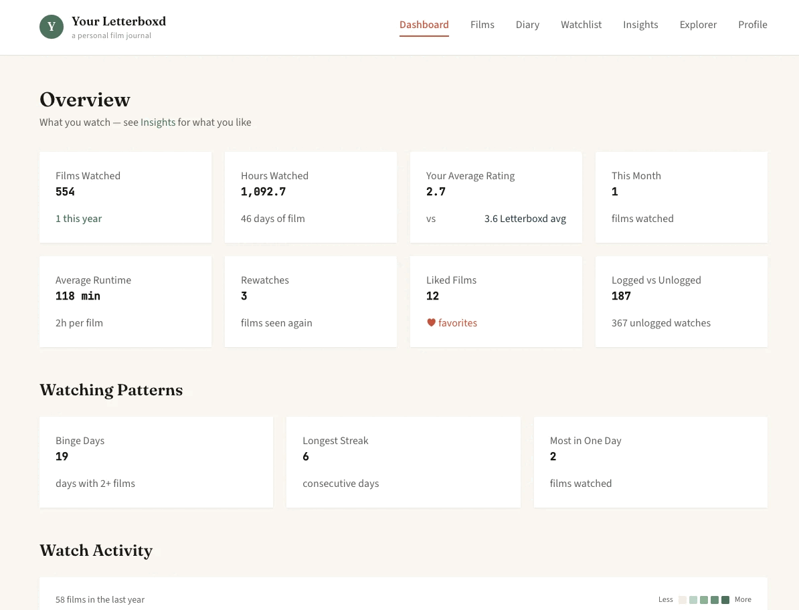

# Your Letterboxd

A self-hosted Letterboxd tracking dashboard.

Inspired by [Your Spotify](https://github.com/Yooooomi/your_spotify), but for movies. It syncs your Letterboxd data and enriches it with metadata from TMDB to give you insights into your watching habits.

Your data is stored locally in a single SQLite database that you own. The app runs in a container and automatically syncs new activity on a schedule, so your watch history builds up over time.



## Features

- **Dashboard** — Watch stats, rating distributions, top genres/directors/actors, calendar heatmap
- **Insights** — Rating personality analysis, hidden gems, unpopular opinions, box office stats
- **Films** — Browse your watched films with sorting and filtering
- **Diary** — View your watch history by date
- **Watchlist** — See what's next on your list
- **Explorer** — Deep dive into combined Letterboxd + TMDB data for each film

## How It Works

The app scrapes your public Letterboxd profile to pull your films, ratings, and diary entries. It then enriches each film with additional data from TMDB: budget, revenue, cast, keywords, certifications, and more.

Data syncs automatically every few hours and is stored locally in SQLite.

## Setup

### Requirements

- Docker and Docker Compose
- A TMDB Read Access Token ([get one here](https://www.themoviedb.org/settings/api))
- A public Letterboxd profile

### Installation

1. Clone the repository

2. Create a `.env` file:
```
LETTERBOXD_USERNAME=your_username
TMDB_ACCESS_TOKEN=your_read_access_token
```

3. Run with Docker Compose:
```
docker compose up -d
```

4. Open http://localhost:60007

The initial sync may take a few minutes depending on how many films you've logged.

## Tech Stack

- **Backend** — Python, FastAPI, SQLAlchemy, SQLite
- **Frontend** — React, TypeScript, Tailwind CSS, Tremor

---

This product uses the TMDB API but is not endorsed or certified by TMDB. Not affiliated with Letterboxd.
